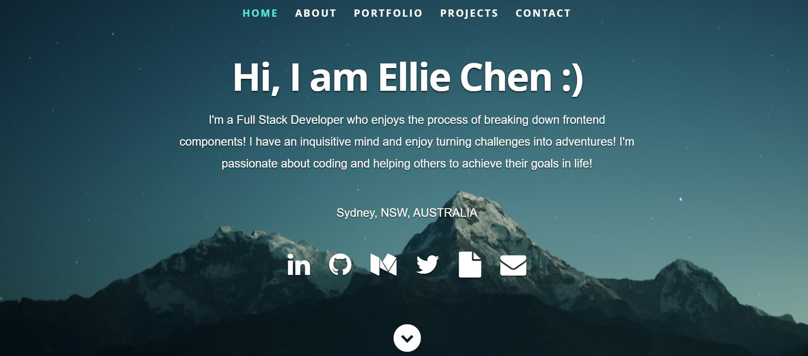
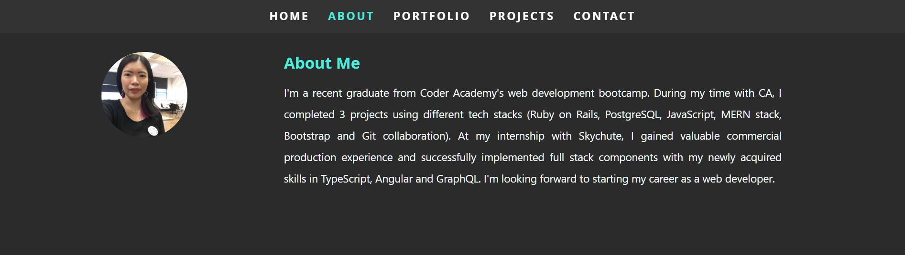
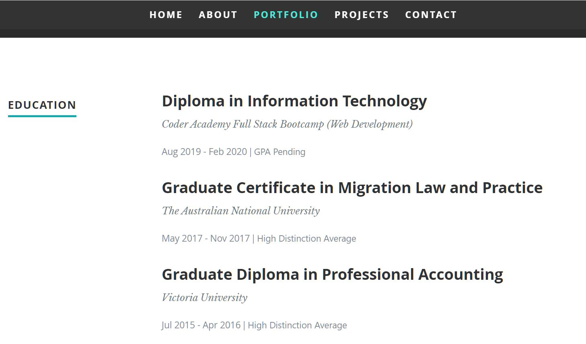
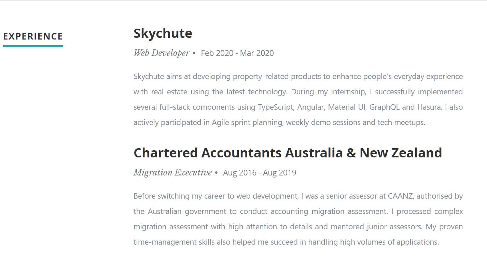
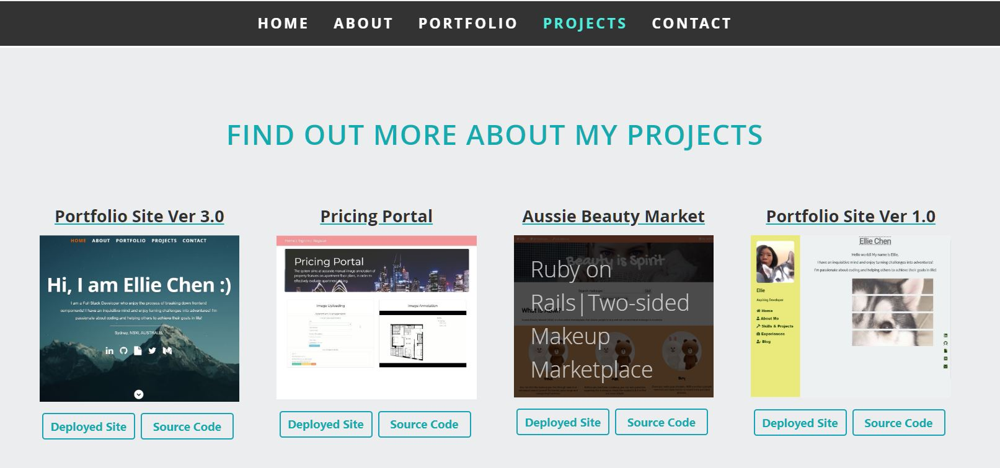
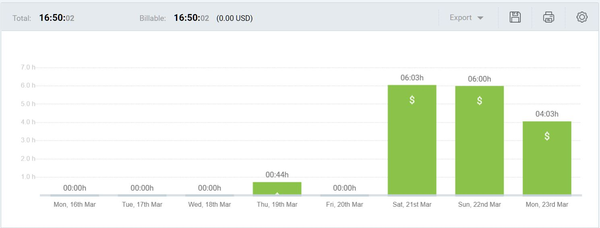

# Portfolio Site Ver. 3 in React

---

- GitHub Repo: https://github.com/EllieChen-Git/Portfolio-Site-V3

- Deployed Site: https://elliechen-react.netlify.app/

---

### Versions of Portfolio Site

- [Ver 1 GitHub Repo](https://github.com/EllieChen-Git/Portfolio-Site_Ellie-Chen) | [Deployed Site](https://elliechen.netlify.com/): A portfolio site built with pure HTML5, CSS3, SCSS and a little bit JavaScript. This is one of the student projects I made when I was studying with Coder Academy. At the time of building this site, I had only learned coding for a month.

- [Ver 2 GitHub Repo](https://github.com/EllieChen-Git/React-Practice-Portfolio-Site): A portfolio site built with React, Material UI, Bootstrap. This a React practice by following YouTube tutorial while I had my second study break with CA.

- [Ver 3 GitHub Repo](https://github.com/EllieChen-Git/Portfolio-Site-V3) | [Deployed Site](https://elliechen-react.netlify.com/): The current portfolio website in React.

---

### Building Process

- This portfolio was built on a template from [Rahul Bhatia](https://github.com/rbhatia46/React-Portfolio).

- Then I adjusted the template into the way I wanted, filled in my data and also changed the data structure to suit my need.

- I also incorporated a little React-Bootstrap & Bootstrap into this project. I will continue to shape the styling of this website with more bootstrap.

- I added screenshots, titles, deployed site and source code buttons in the 'Projects' section.

- I rebuilt the 'Contact' section and used third party service 'Formspree' to manage the message/email submission.

- I twisted the styling of this site a bit. Although it might be not obvious, but styling is always very time-consuming.

- I deployed the site to Netlify with an environment variable.

---

### Challenges Encountered

1. After I tried to import 'react-bootstrap', I encountered an uncaught type error due to the react version for the template is too old. Problem was solved after reading [a stack overflow post](https://stackoverflow.com/questions/58688463/getting-uncaught-typeerror-object-is-not-a-function-in-themeprovider-js-of) and update the React and React-Dom version from "^16.6.0" to "^16.6.8" for this project.

2. I tried to create an environment variable to store a piece of information, but failed to do so. With [a bit research](https://create-react-app.dev/docs/adding-custom-environment-variables/), I realised that :

- With React, the environment variable needs to start with 'REACT*APP*'
- I need to re-start my server every time I change the .env file

which I did learn about this while I was with CA, but I guess at that time I was just trying to follow the teacher's instruction closely without knowing why. After this project, I think I'll never forget about this :)

---

### Website Screenshots

- Header

- About me

- Education & Experience

- Projects

---

### Project Management

I use Clockify to track my productive time in life (how much time I spend on learning, building side projects, applying to jobs etc). The time breakdown for this project is as below:

**Total hours: about 17hrs (16hrs 50mins)**

- Brainstorming: 1hr
- Initial adjustment: 5.5hrs
- README file: 1hr
- Tech Stacks & Project Section: 3hrs
- Contact Form & Third-Party Service: 3hrs
- Styling: 3hrs
- Deployment: 20mins

**Update after Deployment**

- Further styling: 1hr

---

©2020 Ellie Chen - All Rights Reserved.
